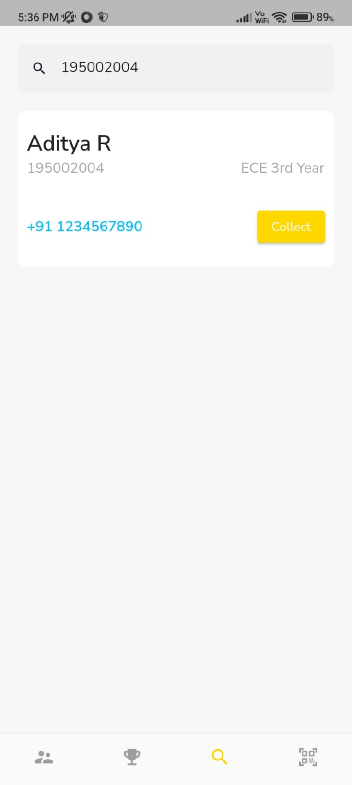
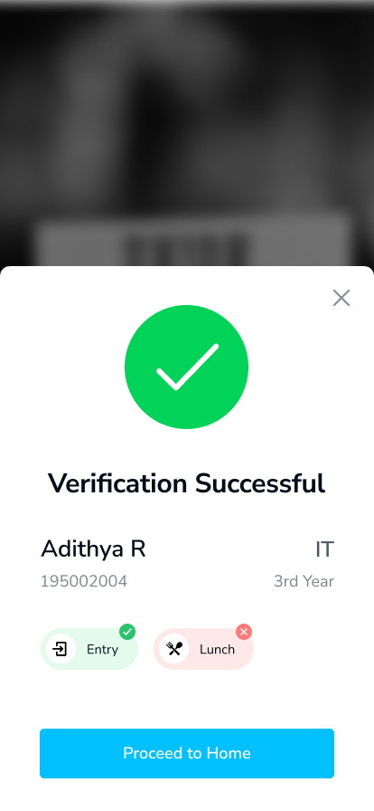

# 🎟️ Sycon Ticketing App

Introducing the SSN Sycon 2022 Ticketing App, your ultimate companion for seamless event management!
This app is designed to enhance the ticketing experience for both users and organizers, ensuring a
smooth and efficient process throughout SSN Sycon Event 2022. Explore the exciting features that
make this app a must-have for event attendees and organizers alike:

📈 User Statistics:

- Gain valuable insights into the event's popularity by tracking the number of tickets sold, which
  department, year bought the most tickets.
- Monitor online and offline money collected for a comprehensive overview of the financial aspects.

📊 Admin Statistics Dashboard:

- Empower organizers with a centralized dashboard providing both overall and individual Organizing
  Committee member statistics (how much each member sold).
- Access real-time data to make informed decisions and streamline event management processes.

🏆 Leaderboard:

- Foster a sense of friendly competition among organizing committee with a dynamic leaderboard
  showcasing the top contributors.
- Encourage engagement and participation by recognizing and rewarding active event supporters.

💵 Offline Money Collection:

- Provide flexibility by enabling offline money collection for those who prefer traditional payment
  methods.
- Seamlessly integrate offline transactions into the app for a unified financial tracking system.

📷 QR Scanner for Entry and Lunch:

- Enhance security and streamline entry processes with a built-in QR scanner for ticket validation.
- Simplify lunch management by utilizing the QR scanner for a hassle-free dining experience.
- With its user-friendly interface and powerful features, the SSN Sycon 2022 Ticketing App
  revolutionizes event management, ensuring a memorable and organized experience for all
  participants. Get ready to elevate your event to new heights with this cutting-edge ticketing
  solution!

## 📱 Screenshots

 
 
 

## 🔌 Plugins

| Name                                                              | Usage                                |
|-------------------------------------------------------------------|--------------------------------------|
| [**firebase_auth**](https://pub.dev/packages/firebase_auth)       | Authentication (Both user and admin) |
| [**firebase_core**](https://pub.dev/packages/firebase_core)       | To use the Firebase Core Api         |
| [**cloud_firestore**](https://pub.dev/packages/cloud_firestore)   | Firestore Database                   |
| [**cloud_functions**](https://pub.dev/packages/cloud_functions)   | To call remote Firebase Functions    |
| [**fl_chart**](https://pub.dev/packages/fl_chart)                 | Graphing and Visualization           |
| [**flutter_riverpod**](https://pub.dev/packages/flutter_riverpod) | State Management                     |
| [**lottie**](https://pub.dev/packages/lottie)                     | Animations                           |
| [**mobile_scanner**](https://pub.dev/packages/mobile_scanner)     | QR Code Scanner                      |

## 🤓 Developer

**[Aditya R](https://github.com/adityar224)**
